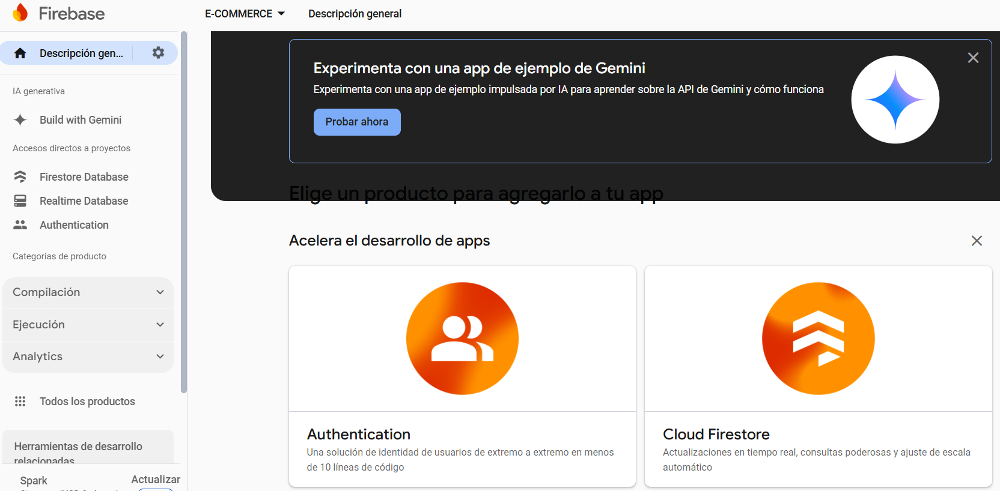
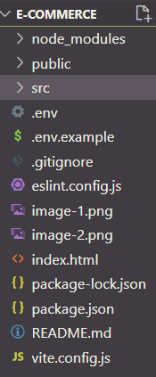
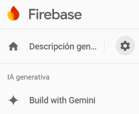
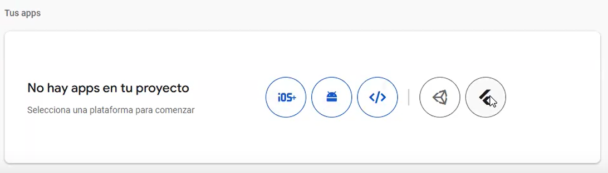

> # **_DESARROLLO WEB CON REACT_** 

>> ## **_Trabajo práctico final "Desarrollo en React JS"_** 
 
>>> ### Consigna: 

Desarrollar un ecommerce con las siguientes paginas:

* Home: Listado de 4 productos. Mostrar nombre, precio, sku, descripcion.
* Detalle de producto: Nombre del producto, descripción, precio, sku.
* Registro: Campos Nombre, Apellido, Email, Contraseña.
* Login: Por Email y Contraseña.

>>> ### Tecnologías utilizadas:

* Vite (versión 5.4.10)
* React Router Dom (Versión 6.28.0) 
* Firebase (Versión 11.0.2)

>>> ### Instalación:

1. Clonar el repositorio: 
   
   ~~~
    git clone https://github.com/TzVera/e-commerce.git 
   ~~~

2. Instalar dependencias:
  
   Previamente utilizar el comando 
   ~~~ 
   cd e-commerce
   ~~~

   * Vite: 
   ~~~
   npm install
   ~~~

   * React Router Dom: 
   ~~~
   npm install react-router-dom
   ~~~

   * Firebase:
   ~~~
   npm install firebase
   ~~~

   Con el comando 
   ~~~
   npm run dev 
   ~~~
    se lleva a cabo inicialización del servidor  http://localhost:5173/

>>>> #### Configuración Firebase:

Se requiere de variables de entorno para el funcionamiento de la página web clonada. Para ello, seguir estos pasos:

1. Con una cuenta de Google, ingresar a Firebase. Clickear en "Go to console" para crear un proyecto de Firebase.

2. Luego, se activa la autenticación (Authentication), y la base de datos (Cloud Firestore).

3. A continuación, crear un archivo .env en la raíz del proyecto. 

Agregar en el archivo las credenciales de la siguiente manera, reemplazando los valores de la derecha que poseen en su nombre la palabra "propia" :

 ~~~
 VITE_API_KEY= api_key_propia
 VITE_AUTH_DOMAIN= auth_domain_propia
 VITE_DATABASE_URL= database_url_propia
 VITE_PROJECT_ID= project_id_propia
 VITE_STORAGE_BUCKET= storage_bucket_propia
 VITE_MESSAGING_SENDER_ID= messaging_sender_id_propia
 VITE_APP_ID= app_id_propia
 ~~~

 La información de las credenciales propias se consiguen en "Configuración del Proyecto" (Project Settings) (Simbolo de engranaje, lado derecho de "Descripción general" (Project Overview)).

 
 
 En la página se realiza scroll hacia abajo, y haciendo click en el simbolo </>, se accede a "Agrega Firebase a tu aplicación web" (Add Firebase to your web app), donde se registra la app. 

 

 Luego del registro se consiguen las credenciales dentro de const firebaseConfig = {(...)}.

>>>> #### Créditos:

- Favicon: 
  
    https://game-icons.net/1x1/lorc/book-aura.html
    
    Book aura icon by [Lorc](https://lorcblog.blogspot.com/) under [CC BY 3.0](https://creativecommons.org/licenses/by/3.0/)

